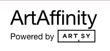

<!-- Improved compatibility of back to top link: See: https://github.com/othneildrew/Best-README-Template/pull/73 -->
<a name="readme-top"></a>


<!-- PROJECT LOGO -->
<br />
<div align="center">
  <a href="https://artaffinity.xyz/"  target="_blank">
    
  </a>

<h3 align="center">Art Affinity</h3>

  <p align="center">
    Art Affinity is your AI tool for finding art you love.
    <br />
    <a href="https://artaffinity.xyz" target="_blank"><strong>View Demo »</strong></a>
    <br />
    <br />
<!--     <a href="https://github.com/github_username/repo_name">Medium</a> -->
    ·
    <a href="https://www.linkedin.com/in/marcel-marais-599095175/"  target="_blank">LinkedIn</a>
  </p>
</div>


<!-- ABOUT THE PROJECT -->
## About


Art Affinity is an AI powered search engine that allows you to search for art using images and text. The search focuses on the actual content of artworks and **not** keywords or meta tags.


https://github.com/marcelmarais/art-affinity/assets/37986581/0c706feb-55c2-4d00-961d-77243b95f371


<p align="right">(<a href="#readme-top">back to top</a>)</p>


### Built With

* [![React][React.js]][React-url]
* [![FastAPI][FastAPI]][FastAPI-url]
* [![PyTorch][PyTorch]][PyTorch-url]
* [![Docker][Docker]][Docker-url]


<p align="right">(<a href="#readme-top">back to top</a>)</p>


<!-- GETTING STARTED -->
## Getting Started

Both the backend and frontend are in this repo, so to get a local version running you only need to clone this repo.
```sh
git clone https://github.com/marcelmarais/art-affinity.git
```

### Setup

#### Backend

The vector database the powers embedding search is [ChromaDB](https://www.trychroma.com/). This needs to run separately from the main backend. You need to set the url / ip address to your chroma instance in the following environment variable:
```sh
export CHROMA_DB_URL="your_chroma_instace"
```

#### Data Ingestion

All data is scraped from [Artsy's](https://www.artsy.net/) partner sites (mostly galleries), for example: [99 Loop Gallery](https://www.artsy.net/partner/99-loop-gallery). This code does not need to be run in a Docker container as it has fewer potential conflicts. To scrape first identify the gallery slug on [Artsy](https://www.artsy.net/) and then run:

```
cd backend
python -m venv venv
source venv/bin/activate
cd src
pip install -r requirements.txt
python scraper/artsty_scraper.py

```

The backend is mainly built with FastAPI and Pytorch. To ensure compatibility you should run everything from the docker container:

  ```sh
  cd backend
  ./buildDocker.sh
  ./runDocker.sh
  ```

#### Frontend

The frontend was created using create-react-app. The design system used is from [Arsty](https://github.com/artsy) - it's called [palette](https://github.com/artsy/palette). To run the development server:
```sh
cd frontend
npm install
npm start
```


<!-- USAGE EXAMPLES -->
## Usage

Use this space to show useful examples of how a project can be used. Additional screenshots, code examples and demos work well in this space. You may also link to more resources.


<!-- LICENSE -->
## License

Distributed under the MIT License. See `LICENSE.txt` for more information.

<p align="right">(<a href="#readme-top">back to top</a>)</p>


<!-- CONTACT -->
## Contact

Marcel Marais -> marcelmarais2000@gmail.com | [marcelmarais.github.io](marcelmarais.github.io) | [Linkedin](https://www.linkedin.com/in/marcel-marais-599095175/)

Project Link: [https://github.com/marcelmarais/art-affinity](https://github.com/marcelmarais/art-affinity)

<p align="right">(<a href="#readme-top">back to top</a>)</p>


<!-- ACKNOWLEDGMENTS -->
## Acknowledgments

Thanks to [Artsy](https://www.artsy.net/) for their design system and for great open engineering in general!

<p align="right">(<a href="#readme-top">back to top</a>)</p>


<!-- MARKDOWN LINKS & IMAGES -->
<!-- https://www.markdownguide.org/basic-syntax/#reference-style-links -->
[contributors-shield]: https://img.shields.io/github/contributors/github_username/repo_name.svg?style=for-the-badge
[contributors-url]: https://github.com/github_username/repo_name/graphs/contributors
[forks-shield]: https://img.shields.io/github/forks/github_username/repo_name.svg?style=for-the-badge
[forks-url]: https://github.com/github_username/repo_name/network/members
[stars-shield]: https://img.shields.io/github/stars/github_username/repo_name.svg?style=for-the-badge
[stars-url]: https://github.com/github_username/repo_name/stargazers
[issues-shield]: https://img.shields.io/github/issues/github_username/repo_name.svg?style=for-the-badge
[issues-url]: https://github.com/github_username/repo_name/issues
[license-shield]: https://img.shields.io/github/license/github_username/repo_name.svg?style=for-the-badge
[license-url]: https://github.com/github_username/repo_name/blob/master/LICENSE.txt
[linkedin-shield]: https://img.shields.io/badge/-LinkedIn-black.svg?style=for-the-badge&logo=linkedin&colorB=555
[linkedin-url]: https://linkedin.com/in/linkedin_username
[product-screenshot]: images/screenshot.png
[Next-url]: https://nextjs.org/
[React.js]: https://img.shields.io/badge/React-20232A?style=for-the-badge&logo=react&logoColor=61DAFB
[React-url]: https://reactjs.org/
[FastAPI]: https://img.shields.io/badge/fastapi-109989?style=for-the-badge&logo=FASTAPI&logoColor=white
[FastAPI-url]: https://fastapi.tiangolo.com/
[PyTorch]: https://img.shields.io/badge/PyTorch-EE4C2C?style=for-the-badge&logo=pytorch&logoColor=white
[PyTorch-url]: https://pytorch.org/
[Docker]: https://img.shields.io/badge/Docker-2CA5E0?style=for-the-badge&logo=docker&logoColor=white
[Docker-url]: https://www.docker.com/
